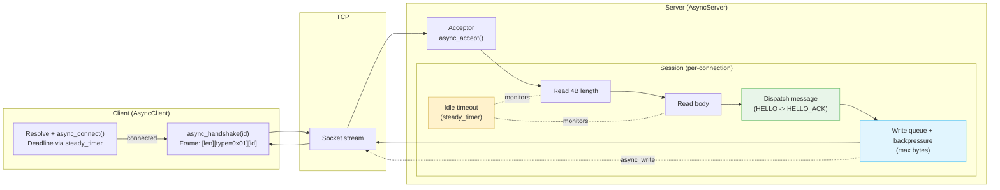
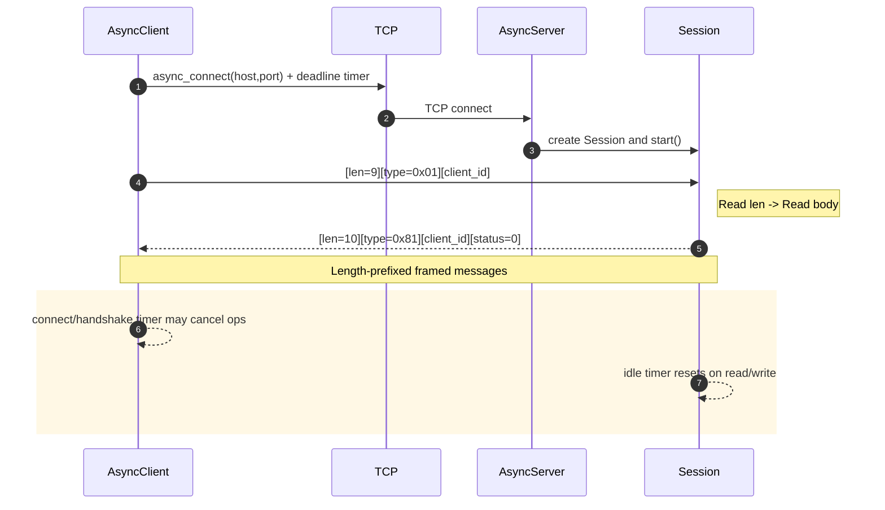
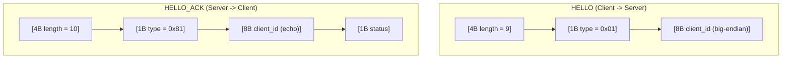

# SwiftWire

SwiftWire is a lightweight, high‑performance C++ networking library built on **Boost.Asio**.

It provides:

- **Async TCP client** — single‑thread friendly, with deadline‑aware connect and handshake
- **Async TCP server** — scalable, configurable thread pool, per‑connection write queue
- **Simple binary framing protocol**:
  - Frame: `[4B big‑endian length] + [body]`
  - HELLO request: `[1B type=0x01][8B client_id]`
  - HELLO_ACK: `[1B type=0x81][8B client_id][1B status]`

---

## 📂 Project structure

```bash
swiftwire/
├─ CMakeLists.txt
├─ include/swiftwire/
│ ├─ protocol.hpp
│ ├─ client.hpp
│ └─ server.hpp
├─ src/
│ ├─ client.cpp
│ └─ server.cpp
└─ examples/
├─ CMakeLists.txt
├─ client_example.cpp
└─ server_example.cpp
```

## 🚀 Getting started

### Requirements

- **C++20** compatible compiler (GCC 10+, Clang 12+, MSVC 2019+)
- **CMake** ≥ 3.16
- **Boost** ≥ 1.74 (`system`, `asio`)

### Build

```bash
git clone https://github.com/yourname/swiftwire.git
cd swiftwire
mkdir build && cd build
cmake -DCMAKE_BUILD_TYPE=Release ..
cmake --build . -j
```

-----------------------------

## 🖥️ Running the examples

### Start the server

```bash
./examples/server_example 0.0.0.0 9000
```

### Run the client

```bash
./examples/client_example 127.0.0.1 9000 12345
```

### Expected output:

```bash
Connected.
HELLO_ACK: id=12345 status=0
```

-----------------------------

## ⚡ Quickstart usage

### Client:

```cpp
#include "swiftwire/client.hpp"
#include <boost/asio.hpp>
#include <iostream>

int main() {
    boost::asio::io_context io;
    auto client = std::make_shared<swiftwire::AsyncClient>(io);

    client->async_connect("127.0.0.1", "9000", std::chrono::seconds(5),
        [client](auto ec) {
            if (ec) return std::cerr << "Connect failed: " << ec.message() << "\n";
            client->async_handshake(42, std::chrono::seconds(5),
                [](auto ec2, uint64_t id, uint8_t status) {
                    if (ec2) std::cerr << "Handshake failed: " << ec2.message() << "\n";
                    else std::cout << "HELLO_ACK: id=" << id << " status=" << int(status) << "\n";
                });
        });

    io.run();
}
```

### Server:

```cpp
#include "swiftwire/server.hpp"
#include <boost/asio.hpp>

int main() {
    boost::asio::io_context io;
    swiftwire::ServerConfig cfg;
    swiftwire::AsyncServer server(io, {boost::asio::ip::make_address("0.0.0.0"), 9000}, cfg);
    server.run();
    io.run();
}
```

## 🗺 Architecture overview

```bash
 ┌────────────┐
 │  Client    │
 └─────┬──────┘
       │ async_connect + handshake
       ▼
 ┌────────────┐
 │ TCP Socket │
 └─────┬──────┘
       │ framed binary protocol
       ▼
 ┌────────────┐
 │  Server    │
 │ (Async IO) │
 └────────────┘
```

- Each frame: [length:4B][body]
- Server spawns multiple I/O threads based on ServerConfig
- Client supports connection & handshake deadlines
- Backpressure is applied via write queue limits

## 🧭 Architecture flow diagram

### High‑level data flow



### Handshake sequence



### Frame formats



## ⚙️ Configuration

Server settings in ServerConfig (in server.hpp):

| Field                  | Description                           | Default           |
|------------------------|---------------------------------------|-------------------|
| threads                | I/O worker threads                    | HW concurrency    |
| idle_timeout           | Disconnect after inactivity           | 60s               |
| max_frame              | Max incoming frame size               | 1 MiB             |
| max_write_queue_bytes  | Per-connection write backlog limit    | 8 MiB             |
| tcp_nodelay            | Disable Nagle’s algorithm              | true             |


## 📜 License
MIT — see LICENSE

## 💡 Next steps
Potential extensions:

- TLS support
- More message types & routing
- SO_REUSEPORT sharding